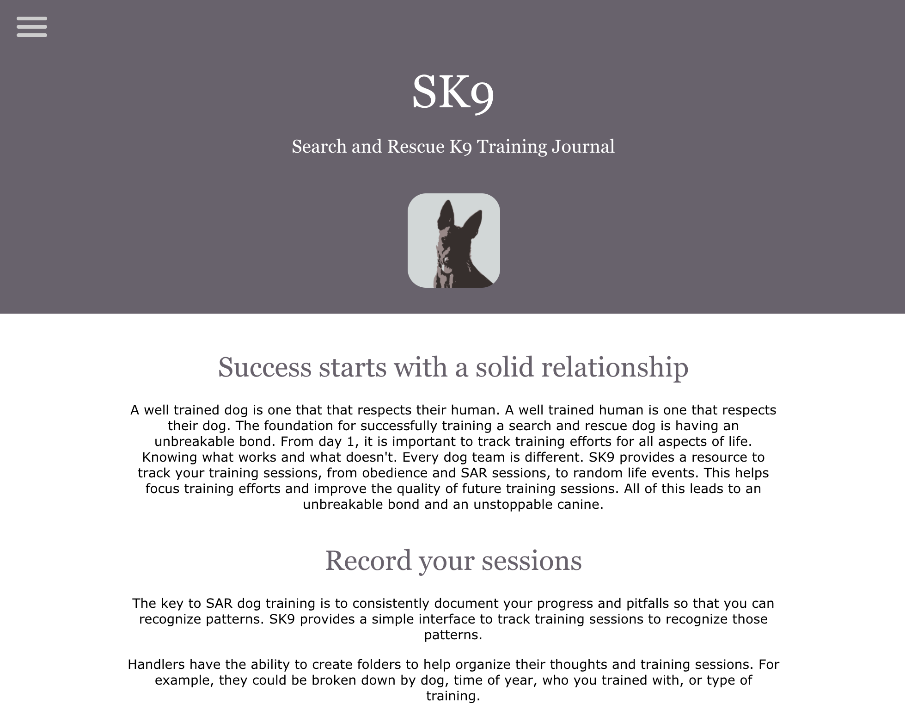
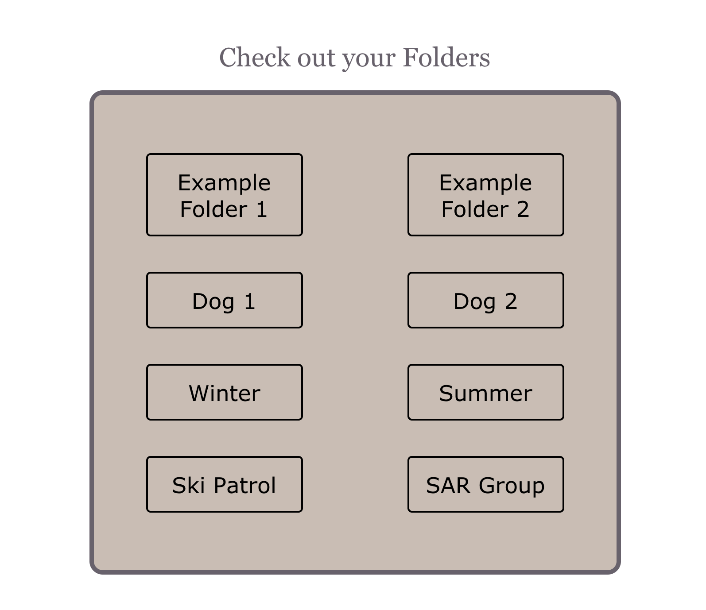
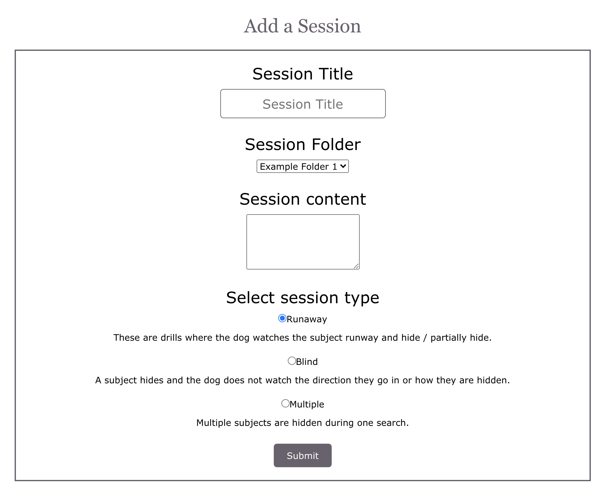

# SK9 - Search and Rescue K9 Training Journal

Live app: (https://sk9.vercel.app/)
API Repo: (https://github.com/amccaff20/sk9-api)

## Table of Contents

- Summary
- Screenshots
- Technologies

## Summary

A well trained dog is one that that respects their human. A well trained human is one that respects their dog. The foundation for successfully training a search and rescue dog is having an unbreakable bond. From day 1, it is important to track training efforts for all aspects of life. Knowing what works and what doesn't. Every dog team is different. SK9 provides a resource to track your training sessions, from obedience and SAR sessions, to random life events. This helps focus training efforts and improve the quality of future training sessions. All of this leads to an unbreakable bond and an unstoppable canine.

The key to SAR dog training is to consistently document your progress and pitfalls so that you can recognize patterns. SK9 provides a simple interface to track training sessions to recognize those patterns.

Handlers have the ability to create folders to help organize their thoughts and training sessions. For example, they could be broken down by dog, time of year, who you trained with, or type of training.

Handlers also have the ability to add training sessions to folders. These sessions include a title for quick reference, details about the training session (think who, what, where, why), drill type, and when the session was created or modified last.

## Screenshots

### Landing Page 

### User Dashboard

### Add a New Session

## Technologies

For this app, I used:

- React.js
- Node.js
- PostgreSQL
- Express
